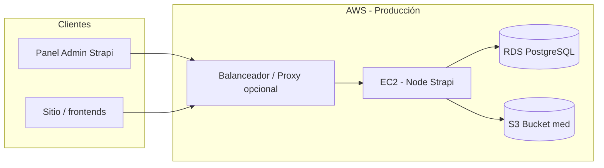
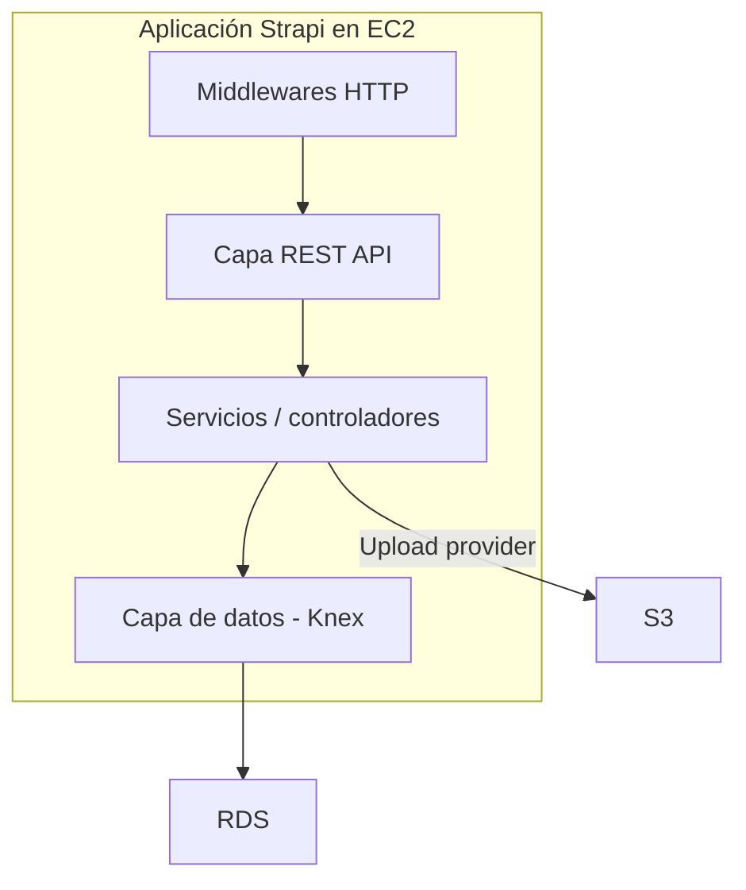

# Arquitectura — CMS Strapi AZFA

Este documento describe la arquitectura lógica y de despliegue del CMS, alineada con **Amazon Web Services (AWS)** en producción: **EC2**, **RDS (PostgreSQL)** y **S3**.

## Vista general

- **Clientes** consumen la API REST (y GraphQL si se habilitara) y el panel de administración.
- **EC2** ejecuta la aplicación Strapi (API + admin embebido).
- **RDS** persiste el modelo relacional del CMS (contenido, usuarios del sistema, permisos, tablas de plugins).
- **S3** almacena binarios (imágenes, documentos) gestionados por el plugin de upload AWS.

## Capas de la aplicación Strapi

1. **Middlewares** (`config/middlewares.ts`): seguridad (CORS, CSP, límites de body), sesión, estáticos y middlewares globales del proyecto.
2. **API REST** (`config/api.ts`, rutas en `src/api/**/routes`): paginación por defecto y límites máximos.
3. **Lógica de dominio** (`src/api/**/controllers`, `services`): reglas por colección.
4. **Persistencia**: consultas hacia PostgreSQL mediante el ORM de Strapi.
5. **Medios**: las operaciones de subida/descarga de archivos del Media Library delegan en `@strapi/provider-upload-aws-s3` hacia el bucket configurado.

## Responsabilidades por servicio AWS

### Amazon EC2

- Aloja el runtime **Node.js** y el proceso `strapi start` (tras `strapi build`).
- Debe definir `PUBLIC_URL` (y normalmente `IS_PROXIED=true`) si hay **Application Load Balancer**, CloudFront u otro proxy delante, para URLs canónicas y cookies.
- Recursos (vCPU, RAM) condicionan concurrencia y tiempos de build; los timeouts HTTP están elevados para subidas grandes (ver `config/server.ts`).

### Amazon RDS (PostgreSQL)

- Única fuente de verdad para **estructura y metadatos** del CMS: tipos de contenido, entradas, relaciones, cuentas del admin, configuración de plugins que se persiste en BD.
- La configuración del cliente está en `config/database.ts` (`DATABASE_*` o `DATABASE_URL`). En RDS suele activarse **SSL** (`DATABASE_SSL=true` y certificados según la guía de AWS).

### Amazon S3

- Bucket dedicado a **objetos de medios**; credenciales y región vía `AWS_*` en `config/plugins.ts`.
- Cifrado en servidor **AES256** y políticas de reintentos configuradas en el proveedor de upload.
- El **Content-Security-Policy** del middleware debe permitir el host del bucket (o el dominio de entrega de medios) para `img-src` / `media-src` según el entorno.

## Flujos típicos

### Lectura de contenido (sitio público)

1. El frontend solicita un recurso REST (por ejemplo una página singleton o una colección).
2. La petición llega a **EC2**; Strapi valida permisos (**Users & Permissions** / tokens).
3. Los datos se leen desde **RDS**; las URL de medios apuntan a **S3** (o dominio configurado).

### Edición en el panel admin

1. El navegador carga el admin desde la misma instancia Strapi en **EC2**.
2. Las operaciones de guardado escriben en **RDS**.
3. Las subidas de archivos envían el objeto a **S3** y guardan la referencia en la base de datos.

### Correo transaccional

- El envío de email (recuperación de contraseña, extensiones, etc.) usa **Nodemailer** contra un SMTP externo (p. ej. Brevo), no forma parte del triángulo EC2/RDS/S3 pero es un integrante opcional del diagrama operativo.

## Archivos de configuración clave

| Archivo | Rol en la arquitectura |
|---------|-------------------------|
| `config/server.ts` | Host, puerto, `PUBLIC_URL`, proxy, timeouts HTTP |
| `config/database.ts` | Conexión a PostgreSQL (RDS) |
| `config/plugins.ts` | Proveedor S3 y email |
| `config/middlewares.ts` | CSP, límites de body, cadena de middlewares |
| `config/admin.ts` | Secretos del panel admin |

## Consideraciones operativas

- **Copias de seguridad**: snapshots de **RDS** y políticas de versionado / replicación en **S3** según política de la organización.
- **Secretos**: preferir **IAM roles** para EC2 → S3 cuando sea posible, en lugar de claves de acceso de larga duración; si se usan variables `AWS_ACCESS_KEY_ID`, rotarlas y restringirlas al bucket.
- **Red**: colocar RDS en subred privada; EC2 en subred con salida a internet o endpoint VPC hacia S3 según diseño.
- **Escalado horizontal**: varias instancias EC2 detrás de un balanceador implican sesiones/cookies y posiblemente colas o almacenamiento de archivos temporales coherente; el estado compartido principal sigue siendo RDS + S3.

Para instrucciones de desarrollo, variables de entorno y listado de colecciones, ver [DOCUMENTACION.md](./DOCUMENTACION.md).
